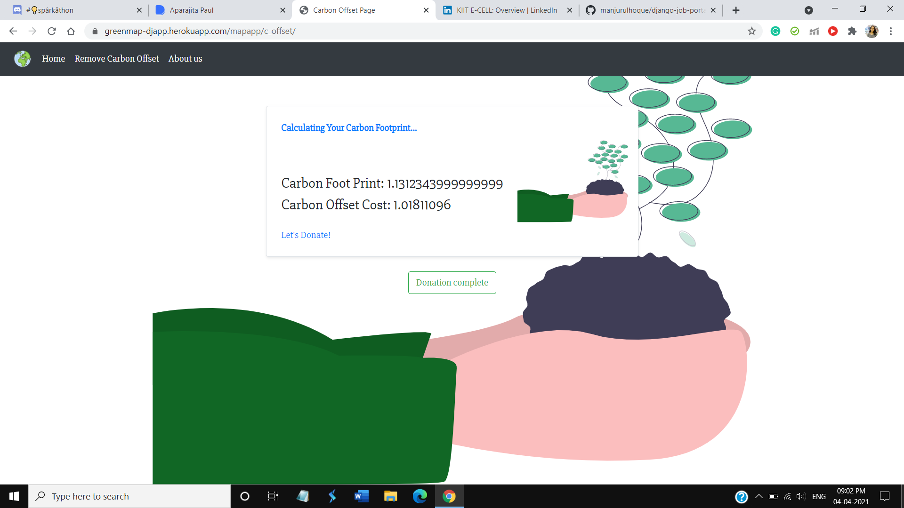

# Green Map
Green Map is a web application, that will help people understand their contribution towards environment and will make everyone aware of their Carbon Offset.

## Features :sparkles:
- :red_car: Calculate your Carbon Footprint while travelling from one place to another.
- :deciduous_tree: Remove Carbon Offset by donating for Tree Plantation.
- :four_leaf_clover: Go Carbon Neutral and contribute for a sustainable future.
- :bike: Choose the right mode of Travel and Get a detailed rout.

## Technologies Used :hammer_and_wrench:
 - :construction: Back-End: Django, Sqlite3 Database
 - :computer: Front-End: Bootstrap, Html5, Css3, JavaScript, jquery
 - :gear: Mapbox Api, Airquality Api

### <a href="https://greenmap-djapp.herokuapp.com/" target="blank">:arrow_forward: Give it a try!!</a>

## ScreenShots :camera_flash:
 
<hr> 

## To run this web-app in your local systems :computer:

### 1. Pre-requisites:
1. Python 3
2. pip 3
### 2. Clone this Repo :
```sh
git clone https://github.com/Tuntai/Green_Map_WebApp.git
cd Green_Map_WebApp
```
You can also download the folder and extract all the files in your local system.<br>
Open your IDE install the requirements.
### 2. Install Requirements :
```sh
pip install django
pip install whitenoise
pip install gunicorn
```
### 3. Apply migrations : 
```sh
python manage.py makemigrations
python manage.py migrate
```
### 4. Run server:
```sh
python manage.py runserver
```
